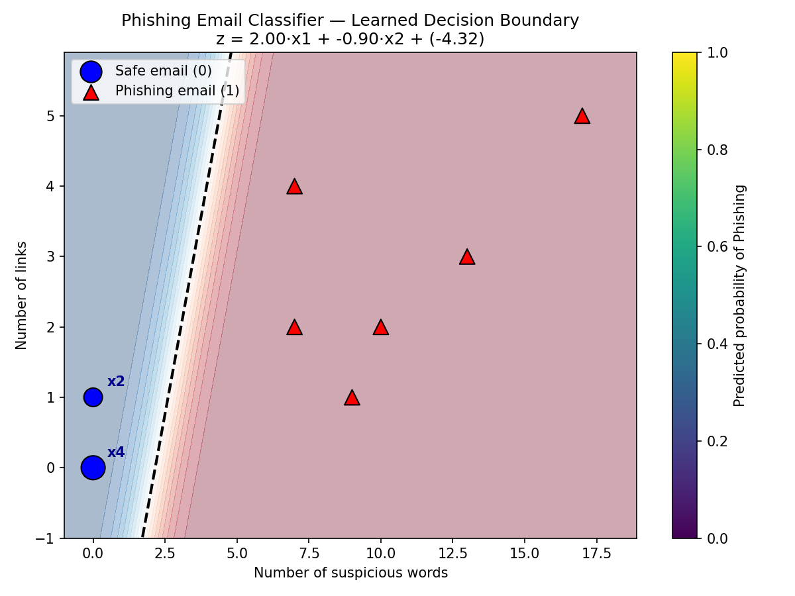

# Phising_classifier
# Phishing Email Classifier — Logistic Regression From Scratch

A tiny binary classification project built with **zero ML libraries**
(no scikit-learn, no numpy, no pandas — just Python's built-in `math`
and `random`). It's designed to be small enough to explain end-to-end
in a few minutes: what the model is, how it learns, and why it makes
the predictions it does.

---

## 1. The Problem

Classify an email as:

| Label | Meaning |
|-------|---------|
| `0`   | Safe email |
| `1`   | Phishing email |

using just **2 features**, kept simple on purpose so the whole thing
can be plotted on a 2D graph:

- `x1` = number of suspicious words in the email (e.g. "urgent", "verify", "password", "click", "winner")
- `x2` = number of links in the email

---

## 2. The Model: Logistic Regression

Logistic regression is the simplest classifier there is. It computes
a weighted sum of the inputs, then squashes that sum into a
probability between 0 and 1.

**Step A — weighted sum:**
```
z = w1*x1 + w2*x2 + b
```
- `w1`, `w2` are weights — how much each feature matters
- `b` is the bias — shifts the decision boundary

**Step B — squash into a probability with the sigmoid function:**
```
probability = 1 / (1 + e^(-z))
```
Sigmoid always outputs a number between 0 and 1, which is exactly
what we want for "how confident is the model that this is phishing?"

**Step C — turn probability into a decision:**
```
if probability >= 0.5 -> predict Phishing (1)
if probability <  0.5 -> predict Safe (0)
```

---

## 3. How the Model "Learns" (Gradient Descent)

We don't know good values for `w1`, `w2`, `b` up front, so we start
with random small numbers and improve them over many rounds
(**epochs**):

1. Run every training email through the model to get a predicted probability
2. Compare the prediction to the real label → this gives an **error**
3. Work out the **gradient**: which direction to nudge each weight to
   reduce that error (this is basic calculus — the derivative of the
   loss with respect to each weight)
4. Nudge the weights a small step (`learning_rate`) in that direction
5. Repeat for 2000 epochs

Over time the loss (measured with **binary cross-entropy**, the
standard loss function for classification) goes down and the weights
converge on values that correctly separate the two classes:

```
Epoch    0 | Loss: 1.5924
Epoch  400 | Loss: 0.0709
Epoch  800 | Loss: 0.0377
Epoch 1200 | Loss: 0.0257
Epoch 1600 | Loss: 0.0195
Epoch 1999 | Loss: 0.0158
```


---

## 4. Visualization

`visualize.py` trains the model and plots:

- 🔵 Blue circles = safe emails from the training data
- 🔺 Red triangles = phishing emails from the training data
- Shaded background = the model's predicted probability at every point in the feature space (blue = safe, red = phishing)
- Black dashed line = the **decision boundary** — the exact line where the model is 50/50 undecided



Emails with few suspicious words and few links (bottom-left) are
confidently classified as safe; emails packed with scare-words and
links (top-right) are confidently classified as phishing. The
dashed line is where `w1*x1 + w2*x2 + b = 0` — the exact geometric
meaning of "decision boundary."

---

## 5. Files in this project

| File | Purpose |
|------|---------|
| `phishing_classifier_scratch.py` | The model: dataset, sigmoid, training loop, prediction — no libraries |
| `visualize.py` | Trains the model and draws `decision_boundary.png` (uses matplotlib **only** for drawing, not for the ML) |
| `decision_boundary.png` | Output image from `visualize.py` |
| `README.md` | This file |

---

## 6. How to Run It

```bash
# Run the classifier: trains, prints loss, tests on new emails
python3 phishing_classifier_scratch.py

# Generate the visualization (requires matplotlib + numpy just for plotting)
pip install matplotlib numpy
python3 visualize.py
```

---
